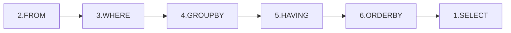

# SQL 문장실행순서란?
 - SQL 순서는 논리적으로 이해하면 좋을거 같다.
 - 실제 옵티마이저가 쿼리변환을해서 실행하는 순서는 다를거라 생각! (예 :여러 쿼리 조인 사용 시)
 - 쿼리 순서는 옵티마이저가 syntax,semantic 오류를 검증하는 순서이기도 함. 
  (예 : 테이블에 없는 쿼리를 where 절에서 호출한 경우 )
#### 1. SQL 6개의 구문
 - SELECT 문장은 총 6개의 절로 구성될 수 있다.

   ```
     1. SELECT 컬럼명(*)  
     2.   FROM 테이블    
     3.  WHERE 컬럼명 = 조건
     4.  GROUP BY 컬렴명 
     5. HAVING 조건식
     6.  ORDER BY 컬럼명
     ```

#### 2. 문장실행순서


FROM  
- 대상 테이블을 참조한다.

WHERE 
- 대상테이블에 해당하는 데이터가 아닌것은 제거한다. (인덱스 엑세스,필터는 추후 작성)  

GROUP BY
- 선언한 컬럼에 해당하는 행들을 그룹화한다.
  
HAVING 
- 결과집합의 행에 대해서 조건이 적용된다
  
SELECT
- 조회 된 컬럼의 값을 보여준다

ORDER BY 
- 데이터를 정렬한다.

#### 오류 예시 
- A라는 테이블에 이름, 나이라는 항목이 있다. 
- WHERE 절에 다른 컬럼을 입력하면 오류 발생 
**테이블 A**

|이름|나이|
|---|---|
|사슴|22|
|돼지|33|


```
SELECT * FROM A WHERE 몸무게 = 33 ;
 오류 발생!!
``` 

